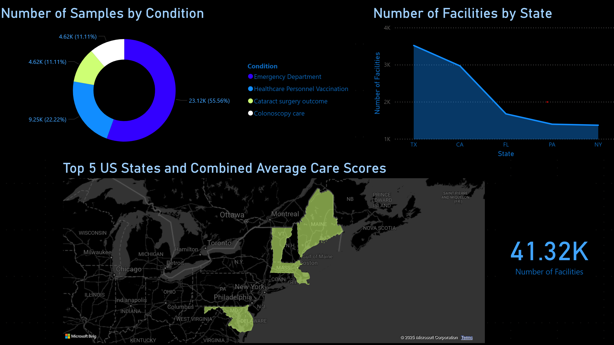

# CMS Conditions & Care Trends Dashboard

## Overview

This dashboard visualizes healthcare facility performance using publicly available CMS (Centers for Medicare & Medicaid Services) data.

It provides a snapshot of care quality across multiple conditions and highlights the top-performing states based on combined average care scores.

The dataset was cleaned to focus on four of the most common Medicaid-reported conditions nationwide, representing a mix of preventive, emergency, and procedural care.

This version serves as a static baseline, with future updates planned for multi-year analysis, SQL joins, and interactive filtering.

## Features

### Number of Samples by Condition
Displays the distribution of facility data across four care conditions

- Emergency Department

- Healthcare Personnel Vaccination

- Cataract Surgery Outcome

- Colonoscopy Care

### Number of Facilities by State
Highlights the states with the largest number of facilities in the dataset.

### Top 5 US States – Combined Average Care Scores (Map)
Shows the top-performing states based on combined average scores for all care conditions.

### KPI: Total Facilities Count
Shows the total number of unique facilities in the dataset.

## Data Source
Centers for Medicare & Medicaid Services (CMS) – Timely and Effective Care dataset
- [CMS Data Website](https://data.cms.gov/provider-data/dataset/yv7e-xc69) 
---

## Tools & Technologies
Power BI for data visualization and dashboard design

VS Code, Jupyter Notebooks, and Pandas for data cleaning, wrangling, and preparation

Pivot Tables in Excel for initial data validation and score consolidation

Bing Maps integration for geographic visualization

## Conclusions 
Analysis of the CMS Timely and Effective Care dataset revealed that Emergency Department metrics account for over half of all reported facility data nationwide, followed by Healthcare Personnel Vaccination (Preventative Care), Cataract Surgery Outcome, and Colonoscopy Care.

Texas and California have the largest number of reporting facilities overall, while the Top 5 states by combined average care scores are concentrated in the Northeast and Mid-Atlantic regions.
These results highlight both geographic variation in facility counts and notable regional clusters of high-quality care across multiple service categories.
